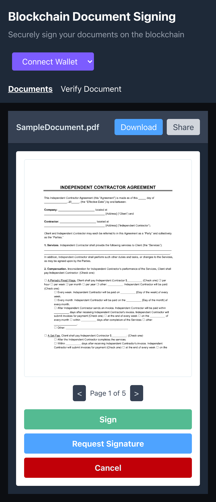

_Blockchain PDF Signer_

A simple React/Vite + Wagmi application to sign PDF documents and record their integrity on a test blockchain (Sepolia).

I'm building this project as a learning exercise to understand how to integrate blockchain technology with web applications.

**Disclaimer:** I'm building this project as a learning exercise to understand how to integrate blockchain technology with web applications using Wagmi. It is not intended for production use.

🚀 **Technologies**

- React (Vite + TailwindCSS)
- Wagmi + MetaMask
- IPFS (P2P file storage)
- Sepolia test network

📌 **Features**

- PDF upload by the user
- SHA-256 hash generation of the document
- File upload to IPFS
- Signing via Ethereum wallet (MetaMask)
- Blockchain record: hash + signer + timestamp
- History of signed documents
